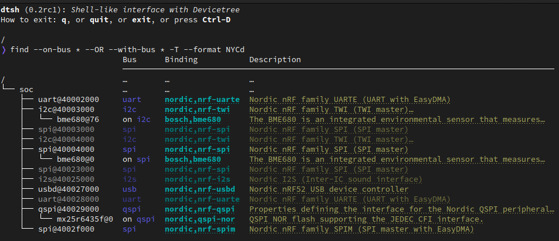

# DTSh

**DTSh** is a Devicetree source (DTS) file viewer with a shell-like command line interface:

- browse a devicetree through a hierarchical file system metaphor
- search for devices, bindings, buses or interrupts with flexible criteria
- filter, sort and format commands output
- generate simple documentation artifacts (text, HTML, SVG) by redirecting the output of commands to files
- *rich* Textual User Interface, command line auto-completion, command history, user themes

The considered use cases include:

- to help getting started with Devicetree: hierarchically or semantically explore a devicetree, contextually access binding files or the Devicetree specification, save figures to illustrate notes
- to have on hand a simple DTS file viewer: quickly check the enabled buses and connected devices or the RAM and Flash memory, get a first insight when debugging a Devicetree issue, document hardware configurations




## Status

This project started as a Proof of Concept for a simple tool that could assist newcomers to Zephyr in understanding what a devicetree is, and how bindings describe and constrain its content: source code and documentation for this prototype are still available as the [main](https://github.com/dottspina/dtsh/tree/main) branch of this repository.

The PoC has since been rewritten and the new code base serves as a proposal to upstream DTSh as a West command: [RFC-DTSh, shell-like interface with Devicetree](https://github.com/zephyrproject-rtos/zephyr/pull/59863)

The **default** branch (`dtsh-next`) now [mirrors](https://github.com/dottspina/zephyr/tree/rfc-dtsh/scripts/dts/dtsh) and [packages](https://pypi.org/project/dtsh/) this work to ensure that interested users won't install and test outdated software, or comment on obsolete issues.

DTSh releases target versions of the Zephyr hardware model, refer to the table bellow:

| DTSh                                                                | Zephyr      | python-devicetree                                                      |
|---------------------------------------------------------------------|-------------|------------------------------------------------------------------------|
| [0.2rc1](https://github.com/dottspina/dtsh/releases/tag/v0.2.0-rc1) | 3.5.x       | [403640b](https://github.com/zephyrproject-rtos/zephyr/commit/403640b) |
| [0.2rc1](https://github.com/dottspina/dtsh/releases/tag/v0.2.0-rc1) | *3.6.0-rc1* | [403640b](https://github.com/zephyrproject-rtos/zephyr/commit/403640b) |

**Latest stable release**: [0.2rc1](https://github.com/dottspina/dtsh/releases/tag/v0.2.0-rc1)


## Getting Started

The DTSh [User Guide](doc/ug/DTSh.pdf) contains extensive documentation and examples (just replace `west dtsh` with `dtsh`): bellow are simple instructions to, well, get started.


### Requirements

DTSh should install and run OOTB on GNU Linux (including WSL) and macOS with Python 3.8 to 3.11.

DTSh will install the following requirements from PyPI:

| Requirement                                          | PyPI                                                 |
|------------------------------------------------------|------------------------------------------------------|
| PyYAML, YAML parser                                  | [PyYAML](https://pypi.org/project/PyYAML/)           |
| Textualize's rich library for *beautiful formatting* | [rich](https://pypi.org/project/rich/)               |
| Stand-alone GNU readline module (macOS only)         | [gnureadline](https://pypi.org/project/gnureadline/) |

On **Windows**, the [GNU Readline](https://tiswww.cwru.edu/php/chet/readline/rltop.html) support will likely be disabled, resulting in a **degraded user experience**: no command line auto-completion nor command history.

> ⚠ **python-devicetree**:
>
> DTSh relies on the [python-devicetree](https://github.com/zephyrproject-rtos/zephyr/tree/main/scripts/dts) library, part of Zephyr, to parse DTS and binding files into Devicetree models.
>
> Although this API should eventually become a *standalone source code library*, it's not currently a priority:
> - it's not tagged independently of the main Zephyr project
> - the [PyPI](https://pypi.org/project/devicetree/) package is no longer updated
>
> When distributed independently of Zephyr, DTSh has therefore to re-package snapshots ([src/devicetree](src/devicetree)) of this library (see [ci: bundle devicetree Python package ](https://github.com/dottspina/dtsh/commit/5e803eb) for details).
>
> As a consequence, it's very likely that you'll generate the DTS files (e.g. `west build`) and open them (e.g. `dtsh build/zephyr/zephyr.dts`) with different versions of the library: although compatibility is mostly determined by the bindings, this might prove confusing in certain circumstances.


### Install

DTSh can be installed in the same Python virtual environment as the West workspace you use for Zephyr development, or stand-alone in any Python environment.

#### Stand-alone

This method installs DTSh in a dedicated Python virtual environment: it's a bit less convenient, but recommended if you prefer to test DTSh without installing anything in a development environment you actually depend on.

For example (Linux and macOS):

``` sh
# Initialize Python virtual environment.
mkdir dtsh
cd dtsh
python -m venv .venv

# Activate and update system tools.
. .venv/bin/activate
pip install --upgrade pip setuptools

# Install DTSh from PyPI.
pip install dtsh
```

To uninstall, just remove your test directory, e.g. `rm -r dtsh`.


#### West Workspace

This method installs DTSh in the same Python virtual environment as a Zephyr workspace.

Assuming you've followed Zephyr [Getting Started Guide](https://docs.zephyrproject.org/latest/develop/getting_started/index.html), the workspace should look like this:

```
zephyrproject/
├── .venv
├── .west
├── bootloader
├── modules
├── tools
└── zephyr
```

Then:

``` sh
# Active the Python virtual environment if not already done.
zephyrproject/.venv/bin/activate

# Install DTSh from PyPI.
pip install dtsh
```

Uninstall as usual: `pip uninstall dtsh`.

**Note**: Installing DTSh in a Zephyr workspace does not make it available as a West command.


### Run

Once installed, DTSh should be available as `dtsh`:

```
$ dtsh -h
usage: dtsh [-h] [-b DIR] [-u] [--preferences FILE] [--theme FILE] [DTS]

shell-like interface with Devicetree

options:
  -h, --help            show this help message and exit

open a DTS file:
  -b DIR, --bindings DIR
                        directory to search for binding files
  DTS                   path to the DTS file

user files:
  -u, --user-files      initialize per-user configuration files and exit
  --preferences FILE    load additional preferences file
  --theme FILE          load additional styles file
```

To open a DTS file, simply pass its path as the command argument:

```
$ dtsh build/zephyr/zephyr.dts
dtsh (0.2rc1): Shell-like interface with Devicetree
How to exit: q, or quit, or exit, or press Ctrl-D

/
❭ cd /soc/flash-controller@4001e000

/soc/flash-controller@4001e000
❭ tree -l
                             Description
                             ─────────────────────────────────────────────────────────────────
flash-controller@4001e000    Nordic NVMC (Non-Volatile Memory Controller)
└── flash@0                  Flash node
    └── partitions           This binding is used to describe fixed partitions of a flash (or…
        ├── partition@0      Each child node of the fixed-partitions node represents…
        ├── partition@c000   Each child node of the fixed-partitions node represents…
        ├── partition@82000  Each child node of the fixed-partitions node represents…
        └── partition@f8000  Each child node of the fixed-partitions node represents…
```

A DTS file alone is actually an incomplete Devicetree source: interpreting its contents requires finding the defining bindings.

By default, DTSh will fist try to retrieve the bindings Zephyr has used at build-time, when the DTS file was generated. For this, it will rely on the CMake cache file contents, assuming a typical build layout:

```
build/
├── CMakeCache.txt
└── zephyr/
    └── zephyr.dts
```

When no suitable CMake cache is available, DTSh will instead try to work out the search path Zephyr would use if it were to generate the DTS *now* (see [Where bindings are located](https://docs.zephyrproject.org/latest/build/dts/bindings-intro.html#where-bindings-are-located)): a valid `ZEPHYR_BASE` is then required.

If the command line does not specify a DTS file path, `dtsh` will try to open the devicetree at `build/zephy/zephyr.dts`. When DTSh is installed in a Zephyr workspace, opening the devicetree of a project you're working on is then as simple as:

```
$ west build
$ dtsh
```
