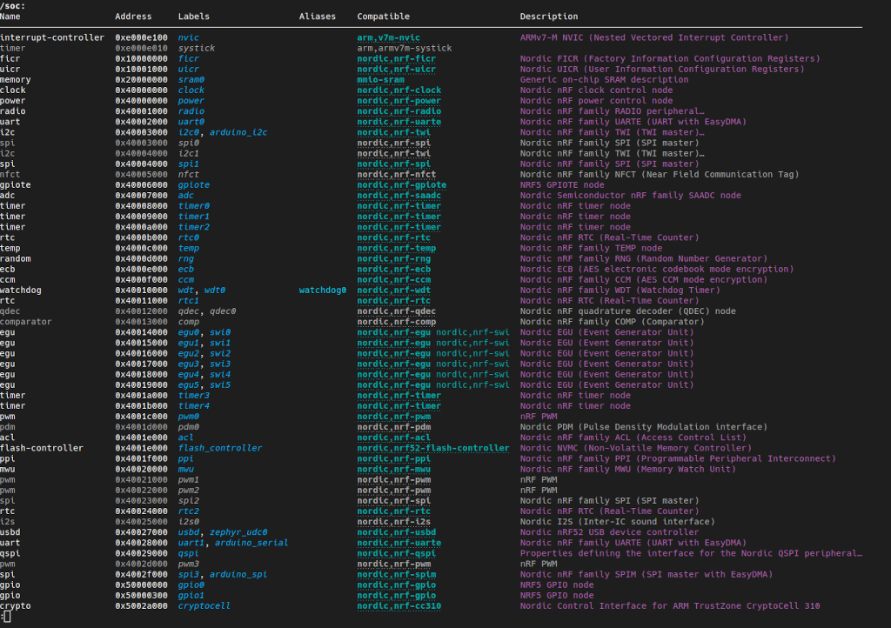

====
dtsh
====

    :Author: Chris Duf

.. contents::

Shell-like interface to devicetrees.

1 Quick startup
---------------

Install in *current Python environment*:

::

    $ git clone https://github.com/dottspina/dtsh.git
    $ cd dtsh
    $ pip install .

The ``dtsh`` command should now be available:

::

    dtsh [dt_source] [dt_bindings]

    where:

    - dt_source: is the path to a devicetree source file (.dts);
                 default to $PWD/build/zephyr/zephyr.dts if unset
    - dt_bindings: is a list of directories to search for bindings files (.yaml);
                   default to the bindings privided by the Zephyr projetc if ZEPHYR_BBASE is set

To open a devicetree shell for a Zephyr project ``foobar`` should be as simple as:

::

    $ cd foobar
    $ west build
    $ dtsh
    dtsh (0.1.0a1): Shell-like interface to a devicetree

    /
    ❯ ls
    /chosen
    /aliases
    /soc
    /pin-controller
    /entropy_bt_hci
    /cpus
    /sw-pwm
    /leds
    /pwmleds
    /buttons
    /connector
    /analog-connector

1.1 Virtual environment
~~~~~~~~~~~~~~~~~~~~~~~

Quick-install in a dedicated Python virtual  environment (assuming Python 3.9 and above):

.. code:: sh

    git clone https://github.com/dottspina/dtsh.git
    cd dtsh
    python -m venv --upgrade-deps .venv
    . .venv/bin/activate
    pip install --upgrade pip setuptools
    pip install wheel
    pip install .

2 Development
-------------

2.1 Virtual environment
~~~~~~~~~~~~~~~~~~~~~~~

Dedicated virtual environment for *hacking* ``dtsh``:

.. code:: sh

    git clone https://github.com/dottspina/dtsh.git
    cd dtsh
    # for Python 3.9 and above
    python -m venv --upgrade-deps .venv
    . .venv/bin/activate
    # for Python 3.7 and 3.8
    python -m venv .venv
    . .venv/bin/activate
    pip install --upgrade pip setuptools
    # pip will prefer wheels when installing from PyPI
    pip install wheel
    # install dtsh in development mode
    pip install --editable .

2.2 Tests
~~~~~~~~~

To run the unit tests:

.. code:: sh

    cd dtsh
    . .venv/bin/activate
    # install test requirements
    pip install ".[test]"
    # run unit tests
    pytest tests
